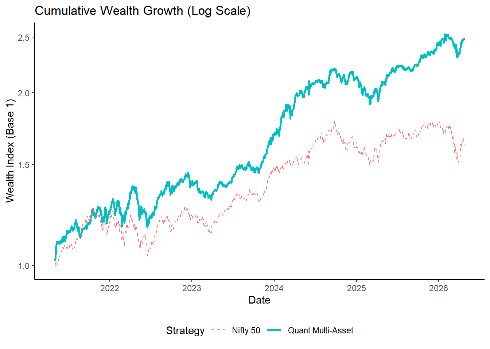
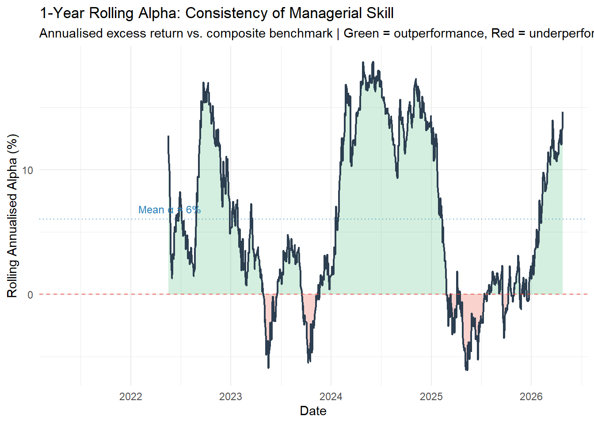
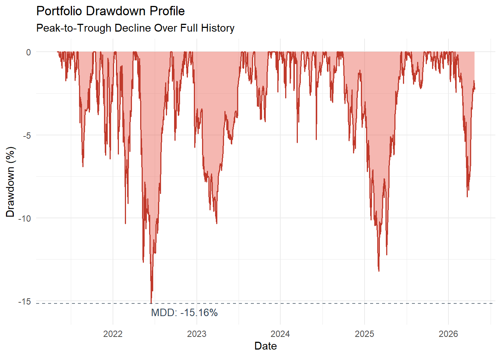
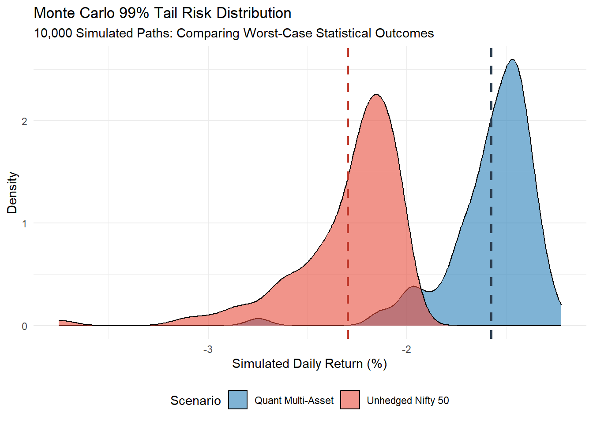

# Dynamic Multi-Asset Portfolio Analysis & Performance Attribution

## Overview
Quantitative performance attribution of a multi-asset mutual fund to assess whether observed alpha is statistically significant, persistent across time, and achieved without hidden tail risk.

## Data
Processed dataset available in `data/processed/cleaned_data.rds`.

## Key Results
- Net Alpha: **8.13% (p = 0.040)**
- Alpha remains positive across rolling windows → not driven by isolated periods
- Rolling Alpha: **78.9% positive periods → persistence**
- Sharpe Ratio: **0.93 vs 0.27 (Nifty benchmark)**
- GARCH Persistence: **0.935 → long volatility memory**
- Tail Risk Reduction: **~0.72% (Monte Carlo)**
- PCA: **55% variance explained → meaningful diversification**

## Methodology
- Data Preparation: Raw financial data processed using scripts in `src/data_prep.R`
- Data Processing: NAV → log returns, TER-adjusted daily  
- Factor Modeling: CAPM + multivariate regression (Equity, Gold, Debt)  
- Time Series: ADF (stationarity), ARIMA (mean), GARCH (volatility)  
- Model Refinement: Ljung-Box → ARMA-GARCH upgrade  
- Risk Analysis: Drawdown, Calmar, CVaR, Monte Carlo (10,000 simulations)  
- Structural Inference: Reverse-engineered allocation logic (volatility-driven equity, tail-risk hedging via gold)

## Key Insight
The fund’s alpha is statistically significant (p = 0.040) and primarily driven by dynamic regime-based asset allocation rather than security selection — indicating systematic exposure timing rather than idiosyncratic alpha generation.

## Repository Structure
- `data/` → raw and processed datasets  
- `notebooks/` → analysis workflow  
- `src/` → reusable modeling functions  
- `outputs/` → plots and tables  
- `report/` → final PDF  

## Sample Outputs

### Performance vs Benchmark


### Rolling Alpha (Consistency of Skill)


### Drawdown Profile


### Tail Risk (Monte Carlo)


## Limitations
- Results are based on in-sample analysis; no out-of-sample validation performed  
- Monte Carlo simulation assumes conditional normality (may underestimate extreme tail risk)  
- Single-fund analysis limits generalizability  
- Factor model may omit latent risk drivers (e.g., macro regime shifts)

## How to Run
```bash
install.packages(c("quantmod", "rugarch", "tseries", "PerformanceAnalytics"))
```

# Author 
Bedangshu Majumder
